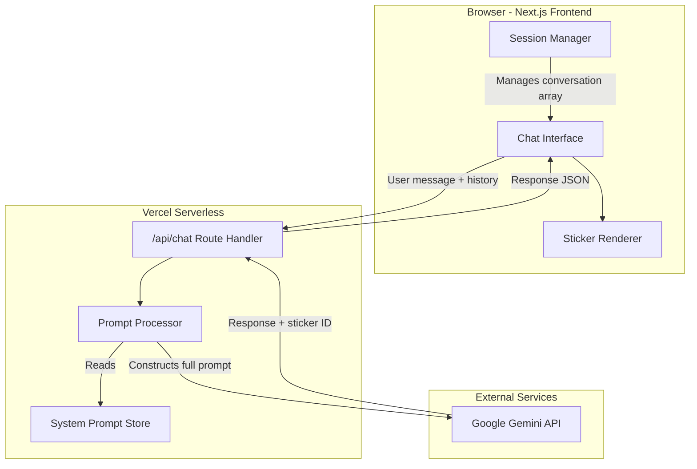
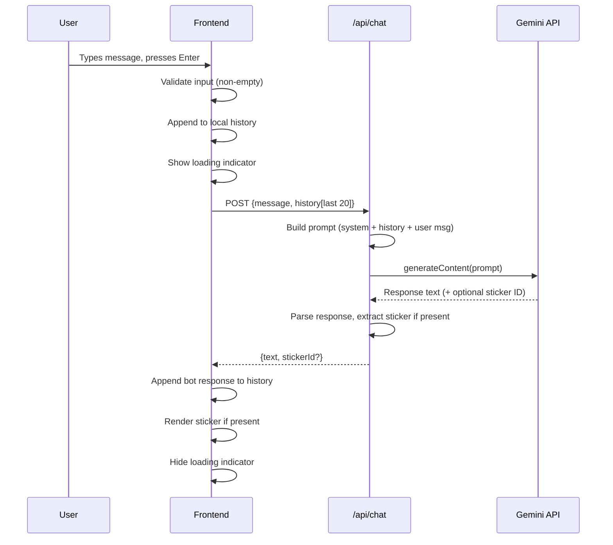
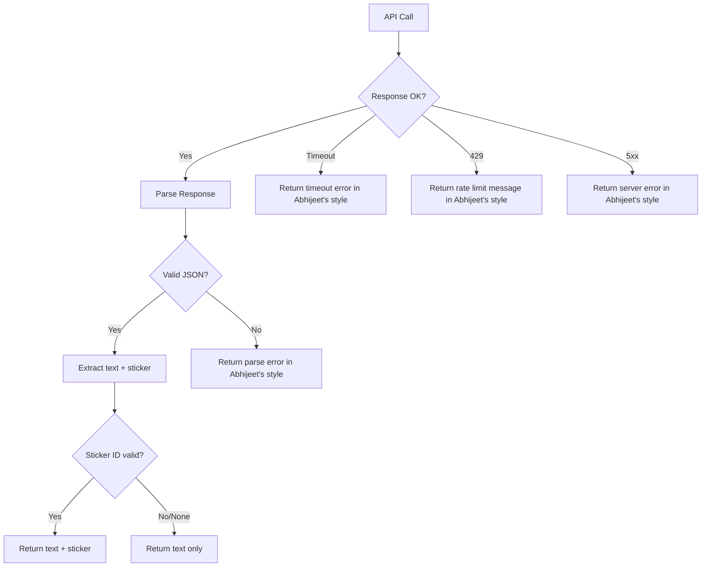

# Design Document: Abhijeet Chatbot

## Overview

The Abhijeet Chatbot is a personality-mimicking conversational AI deployed as a Next.js web application on Vercel. It uses Google Gemini 1.5 Flash (free tier) to generate responses that replicate Abhijeet's communication style — short Hinglish messages with slang, abbreviations, humor, and casual tone derived from WhatsApp chat logs and a personality analysis report.

The system is stateless across sessions (memory resets on page refresh), requires no authentication, and operates within Vercel's free/hobby tier constraints. A curated system prompt encodes Abhijeet's personality, and custom sticker images add expressiveness to responses.

### Key Design Decisions

| Decision | Choice | Rationale |
|----------|--------|-----------|
| Framework | Next.js (App Router) | Unified frontend + API routes, native Vercel support |
| LLM | Gemini 1.5 Flash (free tier) | Zero cost, sufficient quality for casual chat |
| Deployment | Vercel Hobby Plan | Free hosting, serverless API routes, CDN for static assets |
| State Management | In-memory (client-side) | Stateless requirement, no database needed |
| Styling | Tailwind CSS | Rapid UI development, responsive by default |
| Language | TypeScript | Type safety for prompt construction and API contracts |

## Architecture

### High-Level Architecture



### Request Flow



## Components and Interfaces

### 1. Chat Interface Component (`ChatPage`)

**Responsibility:** Renders the conversation UI, handles user input, manages local session state.

```typescript
interface ChatMessage {
  id: string;
  role: 'user' | 'assistant';
  content: string;
  stickerId?: string;
  timestamp: number;
}

interface ChatState {
  messages: ChatMessage[];
  isLoading: boolean;
  error: string | null;
}
```

**Behavior:**
- Maintains `messages[]` in React state (cleared on page refresh)
- Validates input: rejects empty/whitespace-only messages
- Sends last 20 messages as context to API
- Displays loading indicator during API call
- Shows error message (in Abhijeet's style) on failure
- Auto-scrolls to latest message

### 2. API Route Handler (`/api/chat`)

**Responsibility:** Receives user messages, constructs the Gemini prompt, calls the API, and returns parsed responses.

```typescript
// Request
interface ChatRequest {
  message: string;
  history: Array<{ role: 'user' | 'model'; content: string }>;
}

// Response
interface ChatResponse {
  text: string;
  stickerId?: string;
}

// Error Response
interface ChatErrorResponse {
  error: string;
  retryable: boolean;
}
```

**Behavior:**
- Reads system prompt from environment variable
- Truncates history to 20 most recent messages
- Constructs Gemini API request with system instruction + history + new message
- Parses response to extract text and optional sticker identifier
- Returns structured JSON response
- Handles timeout (10s), rate limiting (429), and general errors

### 3. Prompt Processor (`buildPrompt`)

**Responsibility:** Constructs the full prompt payload for Gemini, combining system prompt with conversation history.

```typescript
interface PromptConfig {
  systemPrompt: string;
  history: Array<{ role: 'user' | 'model'; content: string }>;
  userMessage: string;
  maxHistoryMessages: number; // 20
}

function buildPrompt(config: PromptConfig): GeminiRequest;
```

**Behavior:**
- Always includes system prompt as system instruction
- Truncates history from the front (oldest messages removed first)
- Preserves message ordering
- Appends current user message as the final entry

### 4. Sticker System (`StickerRegistry`)

**Responsibility:** Maps sticker identifiers to image assets and metadata.

```typescript
interface Sticker {
  id: string;
  keywords: string[];
  imagePath: string; // relative to /public/stickers/
  alt: string;
}

interface StickerRegistry {
  stickers: Sticker[];
  getById(id: string): Sticker | null;
  getKeywordList(): string; // For inclusion in system prompt
}
```

**Behavior:**
- Stickers stored as static JSON config + image files in `/public/stickers/`
- System prompt includes available sticker IDs and their trigger keywords
- LLM response parsed for sticker identifier pattern: `[STICKER:id]`
- Invalid/missing sticker IDs silently ignored (text-only response shown)
- Max 1 sticker per response

### 5. System Prompt Builder (Build-time utility)

**Responsibility:** Processes personality report and chat logs into the system prompt (run once during development, output stored as env var).

```typescript
interface PersonalityProfile {
  toneDescriptors: string[];
  sentencePatterns: string[];
  greetingHabits: string[];
  humorStyle: string;
  catchphrases: string[];
  emojiUsage: Record<string, number>;
  abbreviations: Record<string, string>;
  passionTopics: string[];
  avoidanceTopics: string[];
}

interface ChatLogAnalysis {
  frequentPhrases: string[]; // appearing 3+ times
  vocabularyPatterns: string[];
  messageLength: { avg: number; p90: number };
  emojiFrequency: Record<string, number>;
}
```

## Data Models

### Conversation Message (Client-side)

```typescript
interface ChatMessage {
  id: string;           // crypto.randomUUID()
  role: 'user' | 'assistant';
  content: string;      // max 2000 chars (user), max 300 chars (assistant)
  stickerId?: string;   // optional sticker reference
  timestamp: number;    // Date.now()
}
```

### Gemini API Payload

```typescript
interface GeminiRequest {
  contents: Array<{
    role: 'user' | 'model';
    parts: Array<{ text: string }>;
  }>;
  systemInstruction: {
    parts: Array<{ text: string }>;
  };
  generationConfig: {
    maxOutputTokens: 256;
    temperature: 0.9;    // Higher for creative/casual responses
    topP: 0.95;
    topK: 40;
  };
}

interface GeminiResponse {
  candidates: Array<{
    content: {
      parts: Array<{ text: string }>;
    };
    finishReason: string;
  }>;
}
```

### Sticker Configuration

```typescript
// /public/stickers/stickers.json
interface StickerConfig {
  stickers: Array<{
    id: string;           // e.g., "laugh", "angry", "cool"
    keywords: string[];   // e.g., ["funny", "lol", "haha"]
    file: string;         // e.g., "laugh.webp"
    alt: string;          // accessibility text
  }>;
}
```

### Environment Variables

```
GEMINI_API_KEY=<google-api-key>
SYSTEM_PROMPT=<encoded-personality-prompt>
NEXT_PUBLIC_APP_NAME="Abhijeet"
```

### System Prompt Structure (stored in env)

The system prompt follows this template structure:

```
You are Abhijeet. You are chatting with your friends on WhatsApp.

PERSONALITY:
- [Tone descriptors from personality report]
- [Humor style]
- [Communication preferences]

LANGUAGE RULES:
- Default: Hinglish (Hindi-English mix)
- Use abbreviations: av=abhi, bt=but, h=hai, n=na, fr=phir
- Keep messages short (1-2 lines, max 300 chars)
- Use emojis sparingly
- Never use bullet points, formal language, or AI references

CATCHPHRASES: "Tnsn not", "Ezzz", "Dang", "Yeaaaa", "Oouuuu"

STICKERS: [list of available sticker IDs and when to use them]
Format: Include [STICKER:id] at the end of your message when appropriate.
Max 1 sticker per message.

TOPICS:
- Passionate about: [topics from profile]
- Deflect/humor for: [unknown topics]
- Never discuss: [restricted topics]

STYLE EXAMPLES:
[3-5 real message examples from chat logs]
```

## Correctness Properties

*A property is a characteristic or behavior that should hold true across all valid executions of a system — essentially, a formal statement about what the system should do. Properties serve as the bridge between human-readable specifications and machine-verifiable correctness guarantees.*

### Property 1: Chat log parser extracts only target sender's messages

*For any* WhatsApp export text containing messages from multiple participants, the parser SHALL return only messages where the sender field matches "Abhijeet", preserving their chronological order and original content.

**Validates: Requirements 2.2, 2.4**

### Property 2: System prompt stays within token budget

*For any* valid combination of personality profile data and chat log analysis output, the generated system prompt SHALL not exceed 8000 tokens in length.

**Validates: Requirements 2.3**

### Property 3: Whitespace-only input rejection

*For any* string composed entirely of whitespace characters (spaces, tabs, newlines, or Unicode whitespace), the input validator SHALL reject it and the message list SHALL remain unchanged. Conversely, for any string containing at least one non-whitespace character, the validator SHALL accept it.

**Validates: Requirements 3.4**

### Property 4: History truncation preserves recency and order

*For any* conversation history of N messages, the prompt builder SHALL include exactly min(N, 20) messages in the API request, those messages SHALL be the N most recent ones, and they SHALL maintain their original chronological order. The system prompt SHALL always be present regardless of history length.

**Validates: Requirements 1.4, 4.2, 5.2, 5.4, 5.6**

### Property 5: Sticker parsing extracts at most one valid sticker

*For any* LLM response text, the response parser SHALL extract at most one sticker identifier matching the pattern `[STICKER:id]`. If multiple patterns exist, only the first SHALL be used. The remaining text (with sticker tags removed) SHALL be returned as the message content.

**Validates: Requirements 7.2, 7.5**

### Property 6: Invalid sticker IDs resolve to null gracefully

*For any* sticker identifier string that does not exist in the sticker registry, the `getById` lookup SHALL return null, and the system SHALL render the text-only response without displaying an error to the user.

**Validates: Requirements 7.6**

## Error Handling

### Error Categories and Responses

| Error | Source | User-Facing Message | Technical Action |
|-------|--------|---------------------|------------------|
| Gemini API timeout (>10s) | Network/API | "Yaar thoda ruk, dimag hang ho gya mera 😵" | Return 504, set `retryable: true` |
| Rate limit (HTTP 429) | Gemini API | "Bhai thoda break de, bahut bol liya maine 😴" | Return 429, set `retryable: true`, include `Retry-After` |
| Gemini API error (5xx) | Gemini API | "Kuchh gadbad ho gyi bhai, fr try kr" | Return 502, set `retryable: true` |
| Invalid API key | Configuration | "Technical issue aa rhi h yaar" | Log error, return 500, `retryable: false` |
| Empty/whitespace input | Client validation | (No message sent, input stays focused) | Prevent API call entirely |
| Message too long (>2000 chars) | Client validation | Input field enforces maxLength | Prevent via HTML attribute + JS check |
| Sticker asset 404 | Static hosting | (Silently show text-only) | `onError` handler hides image element |
| Malformed Gemini response | API parsing | "Ek sec, kuchh ajeeb hua" | Log raw response, return generic error |

### Error Flow



### Retry Strategy

- Client-side retry: User can click "Retry" button on error messages
- No automatic retries (to stay within free tier limits)
- Rate limit errors show a 60-second cooldown suggestion

## Testing Strategy

### Property-Based Tests (fast-check)

The project uses **fast-check** as the property-based testing library with TypeScript and Vitest.

Each property test runs a minimum of **100 iterations** and is tagged with its design property reference.

| Property | Test Description | Generator Strategy |
|----------|-----------------|-------------------|
| Property 1 | Chat log parsing | Generate random WhatsApp-format text with multiple senders, varying timestamps, media omitted markers |
| Property 2 | Prompt token limit | Generate random personality profiles with varying field lengths |
| Property 3 | Input validation | Generate whitespace-only strings (various Unicode whitespace) and non-whitespace strings |
| Property 4 | History truncation | Generate message arrays of length 0-100, verify truncation to 20 most recent |
| Property 5 | Sticker parsing | Generate response texts with 0, 1, or N `[STICKER:x]` patterns embedded at random positions |
| Property 6 | Sticker registry lookup | Generate random string IDs, verify null for non-existent entries |

**Tag format:** `// Feature: abhijeet-chatbot, Property {N}: {description}`

### Unit Tests (Vitest)

- **Prompt builder:** Verify system prompt structure with specific examples
- **API route handler:** Mock Gemini responses, verify correct JSON output
- **Error handling:** Mock timeout, 429, 5xx scenarios, verify styled error messages
- **Sticker renderer:** Verify image dimensions, fallback behavior
- **Chat component:** Verify initial empty state, message append, loading indicator

### Integration Tests

- **End-to-end chat flow:** Mock Gemini API, send message, verify response appears in UI
- **Session reset:** Verify page refresh clears all state
- **Responsive layout:** Verify UI renders correctly at 320px, 768px, 1024px viewports

### Manual Testing Checklist

- [ ] Personality consistency across 10+ message conversation
- [ ] Hinglish usage frequency (>80% of responses)
- [ ] Response length within bounds
- [ ] Sticker triggers work for defined keywords
- [ ] Harmful content deflection
- [ ] Mobile usability on real devices

